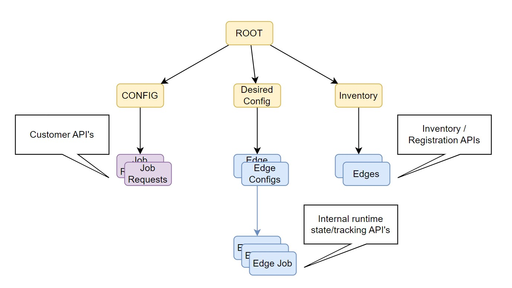
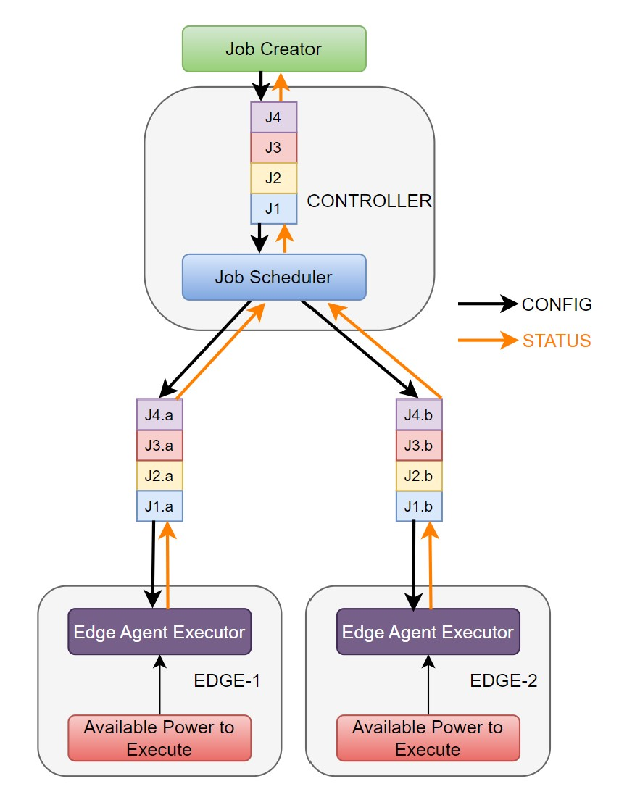

# Job Scheduler
This project is a simulated demo app showing an architecture for building multi cluster applications that can share a data model. 

The demo app also show the following attributes that are useful for app design /development.
- Event driven / time based reconcilers for a config. 
- Restartable application for crash protection and application upgrade
- Status flow through multiple layers of the application stack.
- Rest/GraphQL/CLI based config of the system.
- Elastic and seemless addition / removal of resource (edges) that participated in the system.
- (TBD) Synchronization of config/status across clusters.
- (TBD) Horizontal scaling of the application.

# Goal

Jobs are being generated with some amount of power requirement to process them. Identify available power across edges and schedule the job based on the availability. 


# Design
There are three modules working together to from a system. 

## Data Model  layout
The datamodel is structured with three primary nodes 
- Config - All external/user configs are stored here. These nodes have specification that can only be modified by an external API call, the system should not modify any of the items stored here. System can generate state information and attach to these nodes. 
- DesiredConfig - These are internal config which are for each edge participating and will be used for storing desired config for each edge. 
- Inventory - These are nodes that are used to hold discovered inventory. System shoudl not directly modify these nodes and use these to store information that is reflection of discovered items. 

Diagram showing data model for the power scheduler 


## Jobs 
Jobs are primary input to the system. 
A job holds information about a task that needs some amount of compute power, for the experiment we allocate the needed power as part of the job definition.
The simulation env has a job-creator that randomely generates jobs and keeps the system busy with scheduling and monitoring them.
Once the job is received the scheduler will split the job into smaller chunks and  allocate the job to be executed on the available edges. The Scheduler also tracks how the jobs are progressing in the system and reports back status to the requester. 
The stauts can be requested using rest apis and will show all the nodes where the job executed or is executing and the respective completion percentage. 

Diagram showing the job flow 


## Job Execution / Edge Setup
All jobs are executed on the edges. Edges are nodes/clusters that are connected over WAN to the controller cluster. It's possible for a large number of edges to participate in the interaction so the nexus sdk provides a sync mechnism that allows for part of the data model to sync to specific edge. This reduces the information being exchanged between edges and leveges event based mechanism to allow for minimal messagig overhead. 

Every edge will have the job execution edge-agent running which will start the execution and update the status in the execution request. 

Diagram showing data model sync between controller and edges


## Setup for the Single node simulation env. 
Make sure you have the k8s cluster context setup as default context
> Install the runtime (from nexus base directory i.e. /.../applications.development.framework.nexus)
```
 CLUSTER_NAME=c1 CLUSTER_PORT=8000 make runtime.install.kind

```
> Install the data model from demo directory (/.../applications.development.framework.nexus/demo/edge-power-scheduler)
```
make dm.install
```
To start the system do the following 
```
# Cleanup the system 
make k8s-clean
# In a terminal start edge-10 (Can repeate for additional edges)
EDGE_NAME="edge-10" ./bin/eps-edge-agent
# In a terminal start the scheduler
./bin/eps-scheduler
# In a terminal start the job requestor
MAXJOBS=0  ./bin/eps-job-requester
```
Additional Edges can be started by running  (Start as many as you want)
```
# In a terminal start edge-11
EDGE_NAME="edge-11" ./bin/eps-edge-agent
```

Interact with the system to see running stats
> Open the rest api viewer at 
http://localhost:8101/intel.com/docs#/

```
# Job Status can be checked by running cli command 
k get jobs.jobscheduler.intel.com -l  nexus/display_name=job-1 -o yaml

# edge status can be seen by running cli command
k get edges.edge.intel.com -l nexus/display_name=edge-10 -o yaml
```

## Setup for multi cluster simulation env.
Deploy kind clusters C1, E1, E2, E3, E4
On C1 install the full data model and the controller for the power scheduler
on E1..4 create the sync agent and specific parts of the data model
< Add details of the test setup>

 ## Additional Demos
 ### Dynamic-Scale-EaseOfOnboarding: Edges can join and leave at any time, part of the demo we can show this as elastic / dynamic system.
 <Add demo steps>
 
 ### A/Resilient: Edges can crash and restart / disconnect and reconnect without loss of system functionality.
<Add Demo Steps>
