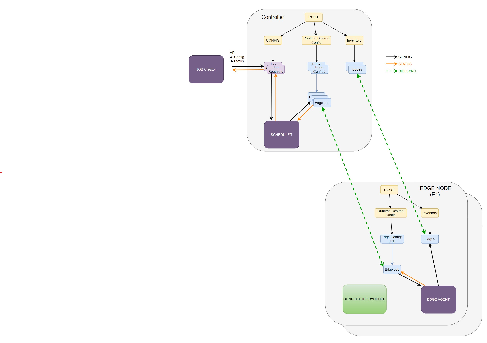

# Job Scheduler
This project is a simulated demo app showing an architecture for building multi cluster applications that can share a data model. 

The demo app also show the following attributes that are useful for app design /development.
- Event driven / time based reconcilers for a config. 
- Restartable application for crash protection and application upgrade
- Status flow through multiple layers of the application stack.
- Rest/GraphQL/CLI based config of the system.
- Elastic and seamless addition / removal of resource (edges) that participated in the system.
- (TBD) Synchronization of config/status across clusters.
- (TBD) Horizontal scaling of the application.

# Goal

Jobs are being generated with some amount of power requirement to process them. Identify available power across edges and schedule the job based on the availability. 


# Design
There are three modules working together to from a system. 

## Data Model  layout
The datamodel is structured with three primary nodes 
- Config - All external/user configs are stored here. These nodes have specification that can only be modified by an external API call, the system should not modify any of the items stored here. System can generate state information and attach to these nodes. 
- DesiredConfig - These are internal config which are for each edge participating and will be used for storing desired config for each edge. 
- Inventory - These are nodes that are used to hold discovered inventory. System should not directly modify these nodes and use these to store information that is reflection of discovered items. 

Diagram showing data model for the power scheduler 


## Jobs 
Jobs are primary input to the system. 
A job holds information about a task that needs some amount of compute power. For the experiment we allocate the needed power as part of the job definition.
The simulation env has a job-creator that randomly generates jobs and keeps the system busy with scheduling and monitoring them.
Once the job is received the scheduler will split the job into smaller chunks and  allocate the job to be executed on the available edges. The Scheduler also tracks how the jobs are progressing in the system and reports back status to the requester. 
The status can be requested using REST apis and will show all the nodes where the job executed or is executing and the respective completion percentage. 

Diagram showing the job flow 


## Job Execution / Edge Setup
All jobs are executed on the edges. Edges are nodes/clusters that are connected over WAN to the controller cluster. It's possible for a large number of edges to participate in the interaction so the nexus sdk provides a sync mechanism that allows for part of the data model to sync to specific edge. This reduces the information being exchanged between edges and leverages event based mechanism to allow for minimal messaging overhead. 

Every edge will have the job execution edge-agent running which will start the execution and update the status in the execution request. 

Diagram showing data model sync between controller and edges



## Setup for the Single node simulation env. 
setup for the dev environment (First time setup)
1. Set the base folder path where the repository is checked out 
```
export NEXUS_REPO_DIR=<addRepoFolderBasePath>/applications.development.framework.nexus
```
2.  Install the runtime (from nexus base directory i.e. /.../applications.development.framework.nexus) (Change the cluster name and port number as needed)
```
cd $NEXUS_REPO_DIR
CLUSTER_NAME=c1 CLUSTER_PORT=8000 make runtime.install.kind
```
3. Make sure three containers are running (a example output is show here) 
```
> docker ps
CONTAINER ID   IMAGE                  COMMAND                   CREATED             STATUS             PORTS                       NAMES
306104102ff6   53f93e0ecc4b           "/bin/sh -c \"/bin/ap…"   About an hour ago   Up About an hour                               nexus-api-gw-c1
951ac0af430d   bitnami/kubectl        "kubectl proxy -p 80…"    About an hour ago   Up About an hour                               k8s-proxy-c1
54f919b6d071   kindest/node:v1.21.1   "/usr/local/bin/entr…"    2 weeks ago         Up 4 hours         127.0.0.1:41507->6443/tcp   c1-control-plane
```
4. Build and install the data model from demo directory (/.../applications.development.framework.nexus/demo/edge-power-scheduler)
``` 
cd $NEXUS_REPO_DIR/demo/edge-power-scheduler
make dm
make dm.install
```

Done with the setup.

### Single cluster Demo with one Edge 
Make sure the setup is done and the data model is installed as described in the previous section.

To run the system you will need to open 3 terminals 
```
cd $NEXUS_REPO_DIR/demo/edge-power-scheduler

# Cleanup the system 
make k8s-clean

# Build the application
make build 

# In a terminal start edge-10 (Can repeat for additional edges)
EDGE_NAME="edge-10" DM_APIGW_PORT=8000 ./bin/eps-edge-agent

# In a terminal start the scheduler
DM_APIGW_PORT=8000 ./bin/eps-scheduler

# In a terminal start the job requestor
DM_APIGW_PORT=8000 ./bin/eps-job-requester
``

This create a demo with a single worker node handling jobs. 
The job requestor will start to backlog job request and the scheduler will schedule on the edge. 

### Adding edges 

Worker edges can be added elastically and the schedule will adept to using them for jobs.

Add a nodes by either creating on a terminal 
```
cd $NEXUS_REPO_DIR/demo/edge-power-scheduler
EDGE_NAME="edge-11" DM_APIGW_PORT=8000 ./bin/eps-edge-agent

```
or by running a script to launch them (This example show running edges 100 to 109 with port as 8000 in parallel )
```
cd $NEXUS_REPO_DIR/demo/edge-power-scheduler
./runsim 100 110 8000
```
or by grouping edges on a single process 
```
# Create a group of 10 edges running as one process
EDGE_COUNT=10 EDGE_NAME="edge-g0" DM_APIGW_PORT=8000 ./bin/eps-edge-agent
```

You can see the edges are dynamically added and the system starts to schedule to them.


### HA Operation of edges / schedular 

Feel free to stop and start any of the edges by hitting Ctrl-C on the terminal. 
The edges service and the scheduler should pick up the work when started.


### API / CLI endpoint for the system 

Interact with the system to see running stats

To interact with API Explorer 
> Open the rest api viewer at http://localhost:8001/intel.com/docs#/


Some CLI commands to get information
```
# General schedular stats can be checked by running cli command
k get schedulerconfigs.jobscheduler.intel.com -o yaml

# Job Status can be checked by running cli command 
k get jobs.jobscheduler.intel.com -l  nexus/display_name=job-1 -o yaml

# edge status can be seen by running cli command
k get edges.edge.intel.com -l nexus/display_name=edge-10 -o yaml

# Watch the load
k port-forward svc/nexus-k8s-proxy 8000:80
watch -n 4 'kubectl  -s localhost:8082 get  schedulerconfigs.jobscheduler.intel.com -o yaml  | egrep "dges|job|total"'

```

## Setup for multi cluster simulation env.
< Add details of the test setup>

 ## Additional Demos - Scale 
<Add Demo Steps>
