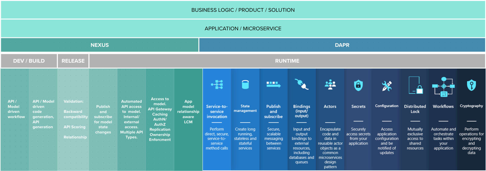

# Nexus & Dapr

[Dapr Official Documentation](https://docs.dapr.io/)

## What is Dapr ?

From the official documentation:
```
Dapr is a portable, event-driven runtime that makes it easy for any developer to build resilient, stateless and stateful applications that run on the cloud and edge and embraces the diversity of languages and developer frameworks. Leveraging the benefits of a sidecar architecture, Dapr helps you tackle the challenges that come with building microservices and keeps your code platform agnostic.
```

It answers the following aspects of the microservices architecture:

* How can my microservice co-exist and work with other microservices in my cluster ?

* How can my microservice, access other functions/features in my cluster ? The functions can be storage, loadbalancer, secrets, application configuration etc.

## What is Nexus ?

Nexus is a dev framework, toolkit and runtime, that provides:
* model driven framework to define the datamodel for a application / business domain
* spec to declare API's to access the datamodel and its status
* distributed, event-driven and consistent runtime to access datamodel through API and SDK
* datamodel propagation / replication that enables seamless access to data regardless of size and scale of the cluster

It answers the following aspects of the microservices architecture:

* What is the specification of my datamodel / state / entities ?
* How are different entities in the datamodel of my business domain related to each other ?
* How can I lifecycle manage state, along with its relationships ?
* How can I expose my state to the user / other applications ?
* How can I access my state ?


## Nexus & Dapr

Dapr's focus can be summarized as:
```
providing runtime building blocks that make it easier for developers to build applications as microservices.
```

Nexus's focus can be summarized as:

```
providing API and State management as a service to develop applications in the cloud-native, microservices architecture
```

The below illustration captures the focus areas is more detail:




### Possible Overlaps

One possible area of overlap is the application configuration management and to some extent, state management at runtime.

**The below tables captures the behaviors, features, similarities and differences between these two framworks, when it comes to state and configuration management, at runtime.**


## Take-aways / Conclusion

* At development and build time, Nexus and Dapr DO NOT have any overlap.

* At runtime:

    * Nexus and Dapr solve related, but different, problem space and usecases for microservice development.

    * In the areas of overlap (i.e configuration management and to some extent state management), we can use Nexus and Dapr to augment each other, to provide the best of both worlds to a microservice developer.

